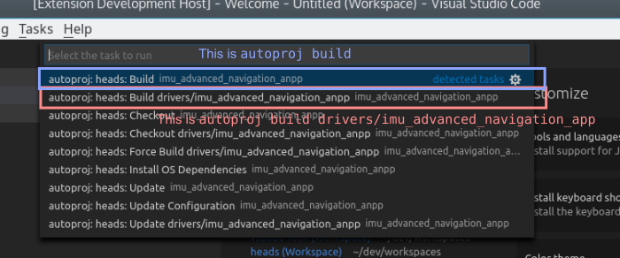
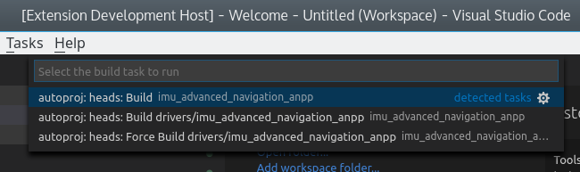

# Rock README

This extension provides basic services related to using Visual Studio Code to
work on a Rock system. It is a VERY recommended install to work on a Rock
workspace.

## Features

- run autoproj commands directly from VSCode and see build/update errors in
  the problem view
- support to ease the creation of launch entries
- seamlessly debug oroGen components directly from VScode

## Installation {#installation}

This extension depends on two other extensions on the VSCode side. These
dependencies are declared, so vscode should install them on installation of
the Rock extension

- Microsoft CPP Tools Extension
- Rebornix Ruby Extension

In addition, the Ruby support requires a set of gems. They must be installed
within your Rock workspace, which currently has to be done manually.

If you add the `rock.vscode` package set to your workspace's `autoproj/manifest` with

~~~
- github: rock-core/rock.vscode-package_set
~~~

Then all these dependencies will be installed by adding the following entry
to your layout. If you are already using the Rock extension in VSCode, do
`Run Task > autoproj: install OS dependencies` and reload VSCode. Otherwise,
run `autoproj osdeps`.

~~~
- rock.vscode.gems
~~~

## Management of Autoproj Workspaces

The extension will start providing commands and support for a given Rock
workspace as soon as at least one package from this workspace is opened in
VSCode (via the "Add Folder to Workspace" command).

Once there is such a folder opened in VSCode, other packages from the same
workspace can easily be added with the `Rock: add package to workspace` command
provided by this extension.

## Important Note about `env.sh`

**Note** there is no need to load the env.sh before you start vscode. Autoproj
generates its own environment. Loading env.sh is even harmful as it would break
if you were opening packages and programs from a different workspace than the one
you loaded the env.sh from.

## Autoproj Integration

The Rock vscode extension automatically creates tasks to handle the common
autoproj operations. These tasks are available as soon as you add a folder that
is within an Autoproj workspace to your VSCode workspace.

Most autoproj subcommands are available as tasks (through the `Run Task` command).
The very-oft used build tasks are also available in the `Run Build Tasks`
command (under the Shift+Ctrl+B shortcut). The created tasks are either
applied to the whole workspace, or to specific packages.

Once Rock packages have been added to your VSCode workspace, the `Run Task`
picker will look like this:

And the `Run Build Task` picker:

**Tip** the last task(s) that have been run are at the top of the picker, which
gives a convenient way to run the same task over and over again.

**Important** if you create a new package, you must add it to the `layout`
section of `autoproj/manifest` and run the `rock - Update package info` 
command before the extension tools can be used for it.

## C++ Packages

The extensions sets and updates a package's IntelliSense configuration so
that it finds the package's compilation database. IntelliSense will only
be valid after you configured the package, so you should build the package
at least once, even if the build fails.

**Important** it is not recommended to put the generated
*`c_cpp_properties.json` file in version control, as it gets re-generated
by the Rock extension. Ideally add it to your package's `.gitignore` file.

## Launch Support

In order to use VSCode's debugging capabilities, this extension provides help
writing launch entries that integrate well within Rock's development workflow.
The following subsections will detail this support on a per-package basis.

This support allow the launch entries to be generic, so that they can be
checked in version control and shared with other developers.

The extension provides a `rock - Add launch config` command to easily create
new launch entries, providing things such as executable selection (for C++
packages) or oroGen model selection (for oroGen models).

### Launching C++ Programs

When within a C++ package, the `rock - Add launch config` command will help
you with selecting the binary you want to run. It discovers binaries within
the package's build directory and proposes them to add to the new
configuration.

**NOTE** due to a bug in VSCode, newly created `launch.json` files are
sometimes not taken into account. If this is the case, you have to reload
VSCode with the `Reload Window` command.

Click on the image below for a demo video:

The generated C++ launch configurations are [standard cppdbg launch
configurations](https://github.com/Microsoft/vscode-cpptools/blob/master/launch.md).
To ease integration within an autoproj workspace, the extension provides the
possibility to use expansions to query information about the autoproj
environment. These expansions can be used in any field within the debug
configuration.

- `${rock:srcDir}` expands to the package's source directory
- `${rock:buildDir}` expands to the package's build directory
- `${rock:prefixDir}` expands to the package's prefix (install) directory
- `${rock:which:cmd}` expands to the full path to the command `cmd` within
   the autoproj workspace's PATH.

### Launching OroGen Components

When within an oroGen package, the `rock - Add launch config` command will
propose to select an oroGen component model or a deployment to debug.

Click on the image below for a demo video:

The generated configurations use an `orogen` debugger entry. These entries
accept most of [the `cppdbg` configuration entries](https://github.com/Microsoft/vscode-cpptools/blob/master/launch.md), but
for the `program` entry. Instead of `program`, one provides either

- the name of an existing deployment in the `deploy` field. The `deployAs`
  field can be used to add a prefix to the deployment task's names, equivalent
  to doing `use_deployment "deployment_name" => "prefix"` in Syskit.
- the name of an existing task model in the `deploy` field, in which case
  the `deployAs` field is mandatory and is the name of the deployed task.

In addition, the `start` field can be used to control whether the task should
be automatically configured and started, and `confDir` points to the configuration
directory.

The same `${rock:...}` expansions than with C++ packages are available.

### Launching Ruby programs

The extension relies on the debugger provided by the Ruby extension. Some gems
[need to be installed](#install) for this to be functional.

The Ruby launch configurations are therefore the [Ruby debugger configurations](https://github.com/rubyide/vscode-ruby/wiki/2.-Launching-from-VS-Code). The
same expansions that are available in C++ entries are also available in the Ruby
entries, that is:

- `${rock:srcDir}` expands to the package's source directory
- `${rock:prefixDir}` expands to the package's prefix (install) directory. This
  currently expands to the same than `srcDir`, but it might change in future
  autoproj versions.
- `${rock:which:cmd}` expands to the full path to the command `cmd` within
   the autoproj workspace's PATH.

### Syskit Workflow

The only syskit-specific workflow available right now is the ability to
configure the Syskit IDE to open file links directly in VSCode. To do so, open
`$HOME/.config/syskit.conf` and create or update the `[Main]` section to have

~~~
cmdline=code --goto %FILEPATH:%LINENO
~~~

For instance, a freshly created `syskit.conf` would look like:

~~~
[Main]
cmdline=code --goto %FILEPATH:%LINENO
~~~

Moreover, as part of a good general Syskit workflow in VSCode, we recommend
creating task entries to start `rock-gazebo` and the IDE. For instance:

~~~
{
    // See https://go.microsoft.com/fwlink/?LinkId=733558
    // for the documentation about the tasks.json format
    "version": "2.0.0",
    "tasks": [
        {
            "label": "rock-gazebo right_margin",
            "type": "shell",
            "command": "cd ${workspaceRoot} ; ../../.autoproj/bin/autoproj exec rock-gazebo right_margin",
            "isBackground": true,
            "problemMatcher": []
        },
        {
            "label": "syskit (gazebo)",
            "type": "shell",
            "command": "cd ${workspaceRoot} ; ../../.autoproj/bin/autoproj exec syskit ide -rgazebo",
            "isBackground": true,
            "problemMatcher": []
        }
    ]
}
~~~

## Known Issues

See [the issue page on GitHub](https://github.com/doudou/rock_website/issues?q=is%3Aopen+is%3Aissue+label%3Avscode)
